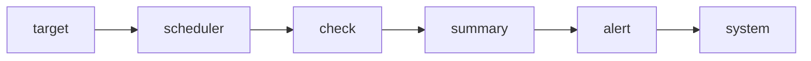

# Contributing to Ping

## Getting Started

1. Fork the repository.
2. Create a feature branch: `git checkout -b feature/<name>`.
3. Install dependencies: `npm install`.

## Coding Standards

- Use **TypeScript** for all new logic.
- Follow the **Module** structure:

- Ensure every new service has a corresponding documentation file in `docs/modules/`.

## Pull Request Process

- Update the `README.md` if you change environment variables.
- Ensure the code passes all linting rules.
- Request a review from Forgata.
