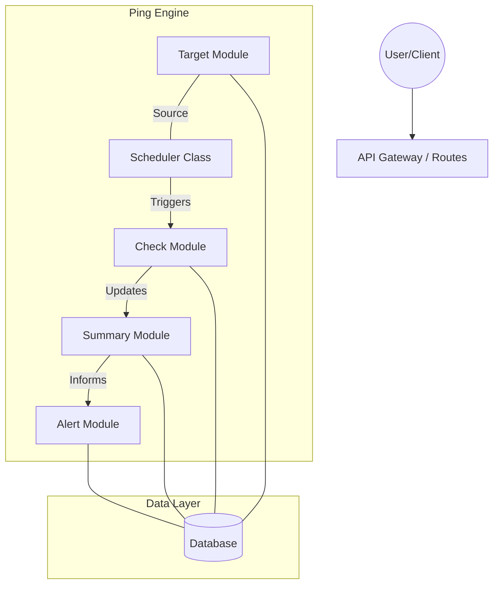
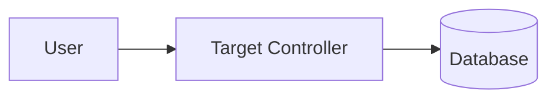

# Architecture

This is a high-level overview of the **Ping** monitoring system. It serves as a technical overivew for developers understand how components interact and where specific logic resides.

---

## System Overview

Ping is designed as a **Modular Monolith**. While it operates as a single service, domain boundaries are strictly enforced to ensure internal components remain decoupled.

---

## Project Structure

All domain-independent logic is located in `src/modules/`. Each module is responsible for owning its database schema, controller logic, and routes.

- **`src/modules/targets/`**: Manages the entities being monitored. Handles CRUD for URLs and interval settings.
- **`src/modules/checks/`**: The execution engine. Handles network probes, retries, and result persistence.
- **`src/modules/scheduler/`**: The system heartbeat. Orchestrates timing and tracks real-time operational state.
- **`src/modules/summary/`**: The data aggregator. Converts raw check results into uptime statistics and health reports.
- **`src/modules/alerts/`**: The notification engine. Evaluates summary data to trigger user alerts (Email, Slack, etc.).
- **`src/modules/system/`**: Internal diagnostics. Provides system health and loop status (e.g., `/system/status`).
- **`src/global/`**: Shared infrastructure including global middlewares, validation schemas, and common utilities.

---

## Core Components & Responsibilities

### The Scheduler

The only class-based module in the system. It manages the global execution state (`isRunning`, `checksInProgress`) and implements a recursive timeout pattern. It ensures that defined rest period only begins after the current batch of concurrent health checks has fully resolved.

### The Check Module

Optimized for high-throughput writes. It implements a "lean persistence" strategy, saving check outcomes with a short TTL. This prevents database bloat and ensures the system remains performant even with high-frequency monitoring.

### The Summary Module

Analyzes the health state of a target over time. It is the logic bridge between raw check data and the Alert module. When a target's health crosses a specific threshold, it tirggers an Alert module action

---

## Data Flows & Interactions

### 1. Target Registration

New targets are validated for URL uniqueness and stored in an "active" state by default.

### 2. The Monitoring Loop

1.  **Scheduler** queries the **Target Module** for targets where `lastCheckedAt + intervalSeconds` <= `now`.
2.  **Scheduler** passes the target identifiers to the **Check Module**.
3.  **Check Module** executes the health probe (network request).
4.  Upon completion, **Check Module** writes the result to the DB and notifies the **Summary Module**.
5.  **Summary Module** recalculates uptime stats and target health.
6.  **Alert Module** evaluates the updated summary to trigger notifications if thresholds are met.

---

## Architectural Decisions

- **One Target per URL**: To prevent redundant network load, the system enforces a strict unique constraint on target URLs at the database and application levels.
- **Recursive Timeout**: The system explicitly avoids `setInterval` to prevent race conditions. A new workload cannot begin until the previous workload is finished.
- **Modular Approach**: Every module handles its own domain logic. Modules must not directly modify external collections; they interact strictly through exported functional services.
- **Short TTL for Checks**: Check results are ephemeral. Ping prioritize real-time state and summarized health over long-term raw log storage to maintain system speed.

---

### Navigation

- For loop orchestration logic: See `../modules/scheduler/check.scheduler.ts`.
- For probe execution logic: See `../modules/checks/check.service.ts`.
- For shared middleware: See `../global`.
